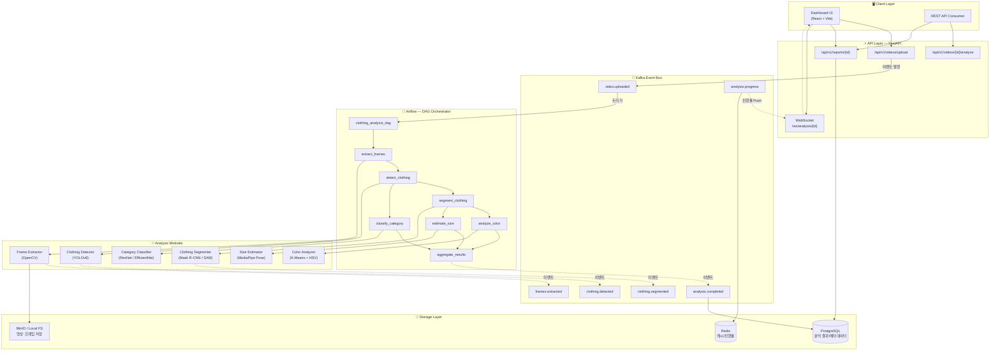
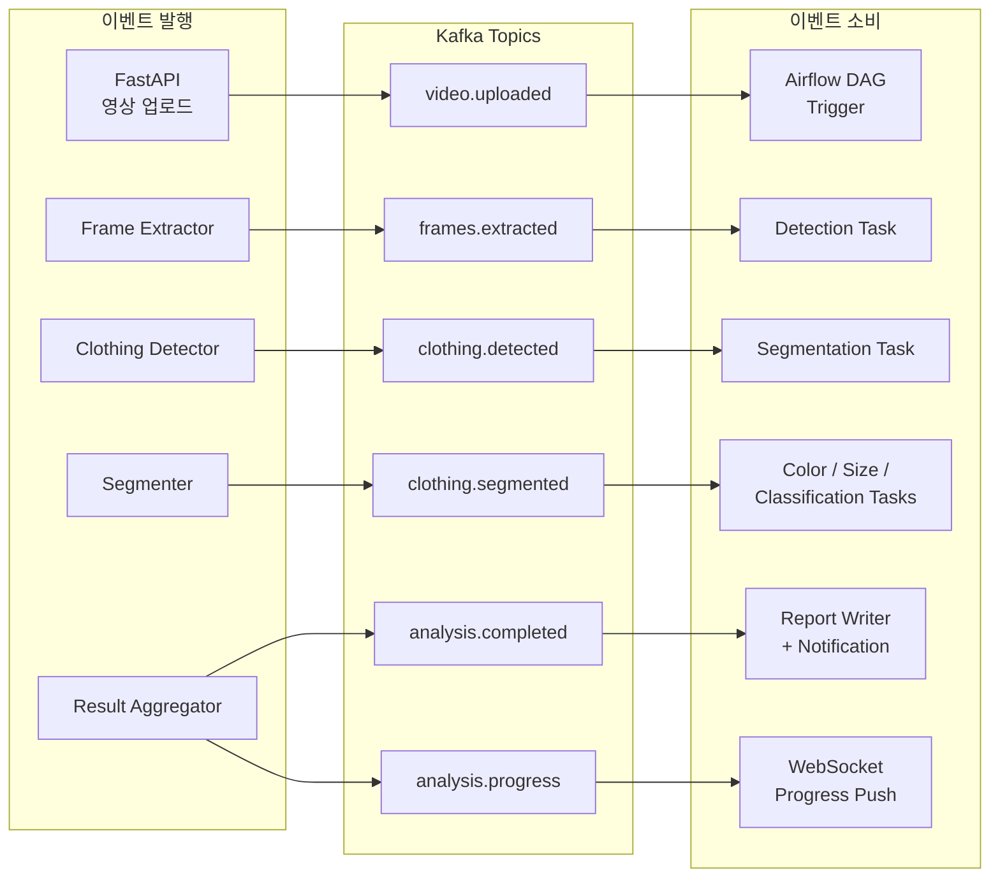
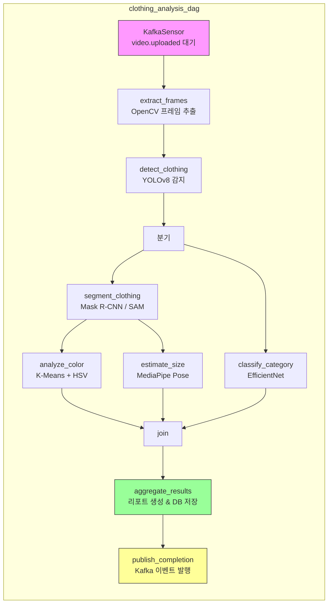
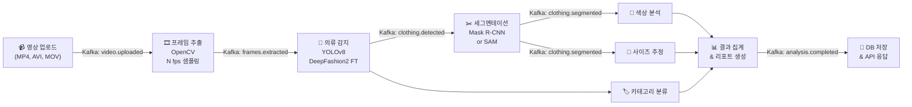
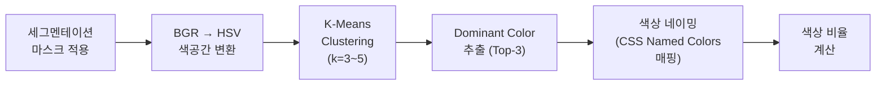
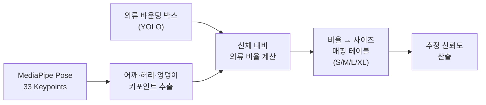
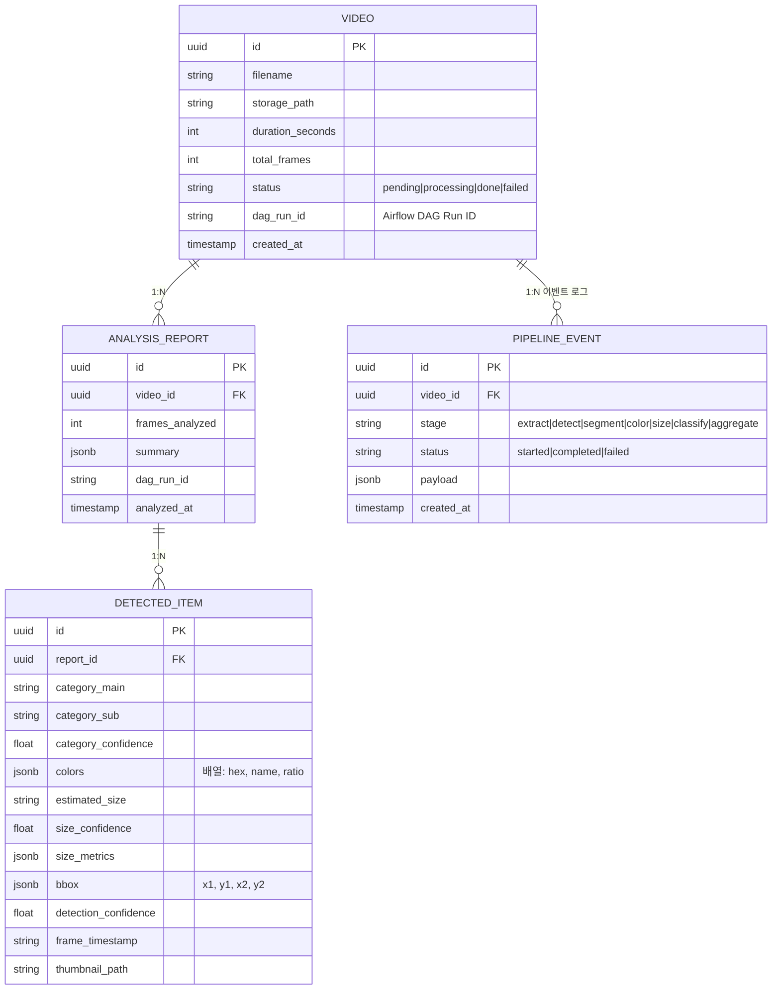
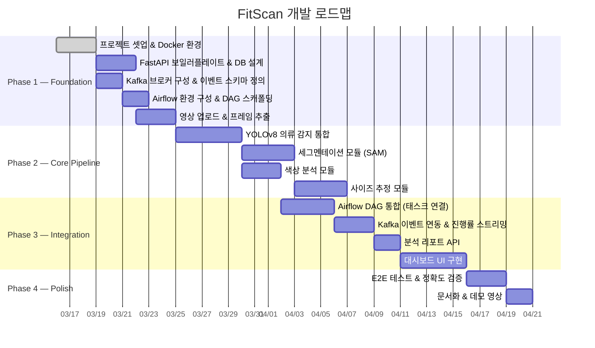

# 👕 FitScan — AI 기반 영상 의류 분석 플랫폼

> 영상에서 의류를 자동 감지하고, 색상·사이즈·카테고리를 추론하는 Event-Driven AI Pipeline

[](https://python.org)
[](https://fastapi.tiangolo.com)
[](https://docs.ultralytics.com)
[](https://airflow.apache.org)
[](https://kafka.apache.org)

---

## 📌 프로젝트 개요

FitScan은 업로드된 영상(MP4 등)에서 프레임을 추출하고, 딥러닝 모델을 활용해 **의류를 자동 감지·분류**한 뒤 **색상 분석**, **사이즈 추정**, **카테고리 분류** 결과를 제공하는 PoC 수준의 AI 영상 분석 플랫폼입니다.

**Kafka** 기반 이벤트 드리븐 아키텍처로 각 분석 스테이지를 디커플링하고, **Airflow** DAG로 파이프라인 오케스트레이션·재시도·모니터링을 관리합니다.

### 핵심 기능

- **의류 감지 (Detection)** — YOLOv8 기반 Object Detection으로 영상 내 의류 아이템 위치 및 바운딩 박스 검출
- **색상 분석 (Color Analysis)** — 세그멘테이션 영역 기반 K-Means 클러스터링으로 의류 주요 색상(Dominant Color) 추출
- **사이즈 추정 (Size Estimation)** — Pose Estimation + 의류 키포인트를 활용한 상대적 사이즈(S/M/L/XL) 추론
- **카테고리 분류 (Classification)** — 상의/하의/아우터/원피스 등 의류 카테고리 자동 분류
- **분석 리포트** — 분석 결과를 구조화된 JSON 및 대시보드 UI로 제공

---

## 🏗️ 시스템 아키텍처



---

## 📨 이벤트 드리븐 아키텍처 (Kafka)

각 분석 스테이지는 Kafka 토픽을 통해 이벤트를 발행·소비하며, 스테이지 간 결합도를 최소화합니다.



### Kafka 토픽 설계

| 토픽 | 발행자 | 소비자 | 페이로드 |
|------|--------|--------|----------|
| `video.uploaded` | FastAPI | Airflow Sensor | `{video_id, storage_path, metadata}` |
| `frames.extracted` | Frame Extractor | Detection Task | `{video_id, frame_paths[], total_frames}` |
| `clothing.detected` | Clothing Detector | Segmentation Task | `{video_id, detections[{bbox, class, conf}]}` |
| `clothing.segmented` | Segmenter | Color/Size Tasks | `{video_id, masks[], item_ids[]}` |
| `analysis.completed` | Result Aggregator | Report Writer | `{video_id, report_id, summary}` |
| `analysis.progress` | 각 스테이지 | WebSocket Handler | `{video_id, stage, progress_pct, message}` |

---

## 🔄 Airflow DAG 오케스트레이션



### DAG 설계 특징

| 항목 | 내용 |
|------|------|
| **트리거** | `KafkaSensor`가 `video.uploaded` 토픽을 폴링하여 DAG Run 자동 시작 |
| **태스크 병렬화** | 세그멘테이션 완료 후 색상 분석·사이즈 추정을 병렬 실행, 분류는 감지 직후 독립 분기 |
| **재시도 정책** | 각 태스크별 `retries=3`, `retry_delay=timedelta(minutes=1)`, 지수 백오프 |
| **실패 격리** | 색상 분석 실패 시에도 사이즈 추정·분류는 정상 진행 (Trigger Rule: `none_failed_min_one_success`) |
| **XCom** | 스테이지 간 경량 메타데이터(경로, ID) 전달, 대용량 데이터는 MinIO 경유 |
| **진행률 추적** | 각 태스크 콜백에서 `analysis.progress` 토픽으로 진행률 이벤트 발행 |

---

## 🔬 분석 파이프라인 상세



### Stage별 기술 상세

#### 1. 프레임 추출 (Frame Extraction)

| 항목 | 내용 |
|------|------|
| 라이브러리 | OpenCV (`cv2.VideoCapture`) |
| 샘플링 전략 | 설정 가능한 FPS 기반 균등 샘플링 (기본: 1fps) |
| 키프레임 감지 | Scene Change Detection으로 중복 프레임 제거 |
| 출력 | JPEG 프레임 이미지 + 타임스탬프 메타데이터 |

#### 2. 의류 감지 (Clothing Detection)

| 항목 | 내용 |
|------|------|
| 모델 | YOLOv8n/s (Ultralytics) |
| 학습 데이터 | DeepFashion2 / ModaNet Fine-tuning |
| 감지 대상 | 상의, 하의, 아우터, 원피스, 스커트 등 13개 카테고리 |
| 출력 | 바운딩 박스 좌표, confidence score, 클래스 라벨 |

#### 3. 의류 세그멘테이션 (Segmentation)

| 항목 | 내용 |
|------|------|
| 모델 옵션 A | Mask R-CNN (Detectron2 기반) |
| 모델 옵션 B | SAM (Segment Anything Model) — 바운딩 박스 프롬프트 방식 |
| 목적 | 의류 영역만 정밀하게 마스킹하여 배경 노이즈 제거 |
| 출력 | 픽셀 단위 세그멘테이션 마스크 |

#### 4. 색상 분석 (Color Analysis)



| 항목 | 내용 |
|------|------|
| 전처리 | 세그멘테이션 마스크로 의류 영역만 추출 + 가우시안 블러 노이즈 제거 |
| 색공간 | HSV 변환 → Hue 기반 색상 그룹핑에 유리 |
| 클러스터링 | scikit-learn K-Means (k=3~5, 의류별 adaptive) |
| 색상 네이밍 | HSV 범위 → 한국어/영어 색상명 매핑 테이블 |
| 출력 | `[{color: "#2E4057", name: "네이비", ratio: 0.65}, ...]` |

#### 5. 사이즈 추정 (Size Estimation)



| 항목 | 내용 |
|------|------|
| 포즈 추정 | MediaPipe Pose (33 landmarks, 실시간 추론 가능) |
| 핵심 키포인트 | 어깨 너비, 상체 길이, 허리-엉덩이 비율 |
| 사이즈 추론 방식 | 신체 키포인트 기반 상대 비율 → 사이즈 등급 매핑 |
| 한계 | 2D 기반 추론이므로 정밀도 한계 존재 → 신뢰도(confidence) 함께 제공 |
| 출력 | `{estimated_size: "L", confidence: 0.78, shoulder_ratio: 1.23}` |

#### 6. 카테고리 분류 (Classification)

| 항목 | 내용 |
|------|------|
| 모델 | EfficientNet-B0 또는 ResNet-50 (Transfer Learning) |
| 학습 데이터 | DeepFashion2 카테고리 라벨 |
| 분류 체계 | 상의(티셔츠/셔츠/니트), 하의(데님/슬랙스/숏), 아우터(자켓/코트), 원피스, 스커트 |
| 출력 | `{category: "상의", subcategory: "티셔츠", confidence: 0.92}` |

---

## 🛠️ 기술 스택

### Backend

| 기술 | 용도 | 선정 이유 |
|------|------|-----------|
| **Python 3.11+** | 메인 런타임 | CV/ML 생태계 최적, 타입 힌트 활용 |
| **FastAPI** | API 서버 | 비동기 지원, 자동 OpenAPI 문서, Pydantic 검증 |
| **Apache Kafka** | 이벤트 버스 | 스테이지 간 디커플링, 이벤트 소싱, 진행률 스트리밍 |
| **Apache Airflow** | DAG 오케스트레이션 | 태스크 의존성 관리, 재시도, 모니터링 UI, 스케줄링 |
| **Redis** | 캐시 / 진행률 | 분석 진행률 임시 저장, API 응답 캐시 |
| **PostgreSQL** | 분석 결과 저장 | JSONB로 유연한 분석 결과 저장, Airflow 메타 DB 겸용 가능 |
| **MinIO / Local FS** | 파일 스토리지 | 영상·프레임 이미지 저장, S3 호환 |
| **SQLAlchemy 2.0** | ORM | 비동기 세션, 타입 안전성 |
| **Alembic** | DB 마이그레이션 | 스키마 버전 관리 |

### AI / ML

| 기술 | 용도 | 선정 이유 |
|------|------|-----------|
| **YOLOv8 (Ultralytics)** | 의류 감지 | SOTA 실시간 Object Detection, 파인튜닝 용이 |
| **Mask R-CNN / SAM** | 세그멘테이션 | 픽셀 단위 의류 영역 추출 |
| **MediaPipe Pose** | 포즈 추정 | 경량·실시간, 33 keypoints |
| **EfficientNet / ResNet** | 분류 | Transfer Learning 효율, 검증된 아키텍처 |
| **OpenCV** | 영상 처리 | 프레임 추출, 이미지 전처리, 색공간 변환 |
| **scikit-learn** | 클러스터링 | K-Means 색상 클러스터링 |
| **PyTorch** | 모델 학습/추론 | CUDA 지원, 커뮤니티 활발 |

### Frontend (대시보드)

| 기술 | 용도 |
|------|------|
| **React + Vite** | SPA 대시보드 |
| **TailwindCSS** | 스타일링 |
| **Recharts / Chart.js** | 색상 분포 차트, 분석 통계 시각화 |
| **React Query** | 서버 상태 관리 |

### Infra / DevOps

| 기술 | 용도 |
|------|------|
| **Docker Compose** | 로컬 개발 환경 구성 (API + Airflow + Kafka + DB + Redis + MinIO) |
| **GitHub Actions** | CI 파이프라인 (린트, 테스트, 이미지 빌드) |

---

## 📂 프로젝트 구조

```
fitscan/
├── README.md
├── docker-compose.yml
├── pyproject.toml
│
├── backend/
│   ├── app/
│   │   ├── main.py                  # FastAPI 엔트리포인트
│   │   ├── config.py                # 환경 설정 (Pydantic Settings)
│   │   │
│   │   ├── api/
│   │   │   └── v1/
│   │   │       ├── videos.py        # 영상 업로드/분석 엔드포인트
│   │   │       └── reports.py       # 분석 리포트 조회 엔드포인트
│   │   │
│   │   ├── domain/
│   │   │   ├── models.py            # SQLAlchemy 모델
│   │   │   └── schemas.py           # Pydantic 스키마
│   │   │
│   │   ├── pipeline/
│   │   │   ├── frame_extractor.py   # 프레임 추출
│   │   │   ├── clothing_detector.py # YOLOv8 의류 감지
│   │   │   ├── segmenter.py         # 세그멘테이션
│   │   │   ├── color_analyzer.py    # 색상 분석
│   │   │   ├── size_estimator.py    # 사이즈 추정
│   │   │   └── classifier.py        # 카테고리 분류
│   │   │
│   │   ├── events/
│   │   │   ├── producer.py          # Kafka Producer 래퍼
│   │   │   ├── consumer.py          # Kafka Consumer (진행률 등)
│   │   │   └── schemas.py           # 이벤트 페이로드 스키마 (Pydantic)
│   │   │
│   │   └── infra/
│   │       ├── database.py          # DB 세션 관리
│   │       ├── kafka_client.py      # Kafka 연결 설정
│   │       └── storage.py           # 파일 스토리지 클라이언트
│   │
│   ├── models/                      # 학습된 모델 가중치
│   ├── alembic/                     # DB 마이그레이션
│   └── tests/
│
├── airflow/
│   ├── dags/
│   │   └── clothing_analysis_dag.py # 메인 분석 DAG
│   ├── plugins/
│   │   ├── sensors/
│   │   │   └── kafka_sensor.py      # Kafka 토픽 폴링 센서
│   │   └── operators/
│   │       ├── frame_operator.py    # 프레임 추출 오퍼레이터
│   │       ├── detection_operator.py# 의류 감지 오퍼레이터
│   │       └── analysis_operator.py # 분석 태스크 오퍼레이터
│   └── airflow.cfg
│
└── frontend/
    ├── src/
    │   ├── pages/
    │   │   ├── Upload.tsx           # 영상 업로드 페이지
    │   │   ├── Analysis.tsx         # 분석 진행/결과 페이지
    │   │   └── Reports.tsx          # 리포트 목록/상세
    │   └── components/
    │       ├── ColorPalette.tsx      # 색상 분포 시각화
    │       ├── SizeEstimate.tsx      # 사이즈 추정 표시
    │       └── DetectionOverlay.tsx  # 바운딩 박스 오버레이
    └── package.json
```

---

## 🔌 API 설계

### 핵심 엔드포인트

```
POST   /api/v1/videos/upload          영상 파일 업로드 → Kafka 이벤트 발행
POST   /api/v1/videos/{id}/analyze    분석 시작 (Airflow DAG 트리거)
GET    /api/v1/videos/{id}/status     분석 진행률 조회 (Redis 캐시)
GET    /api/v1/reports/{id}           분석 리포트 조회
GET    /api/v1/reports                리포트 목록 (페이지네이션)
WS     /ws/analysis/{id}             분석 진행률 실시간 Push (Kafka Consumer)
```

### 분석 리포트 응답 예시

```json
{
  "report_id": "rpt_abc123",
  "video_id": "vid_xyz789",
  "analyzed_at": "2026-03-16T14:30:00Z",
  "total_frames_analyzed": 120,
  "dag_run_id": "clothing_analysis__2026-03-16T14:25:00",
  "items": [
    {
      "item_id": "item_001",
      "category": {
        "main": "상의",
        "sub": "티셔츠",
        "confidence": 0.94
      },
      "colors": [
        {"hex": "#2E4057", "name": "네이비", "ratio": 0.65},
        {"hex": "#FFFFFF", "name": "화이트", "ratio": 0.25},
        {"hex": "#C0392B", "name": "레드", "ratio": 0.10}
      ],
      "estimated_size": {
        "label": "L",
        "confidence": 0.78,
        "metrics": {
          "shoulder_width_ratio": 1.23,
          "torso_length_ratio": 0.95
        }
      },
      "detection": {
        "bbox": [120, 80, 340, 420],
        "confidence": 0.91,
        "frame_timestamp": "00:00:03.500"
      },
      "thumbnail_url": "/api/v1/frames/frm_001/thumbnail"
    }
  ],
  "summary": {
    "total_items_detected": 3,
    "dominant_color": "#2E4057",
    "size_distribution": {"M": 1, "L": 2}
  }
}
```

---

## 📊 데이터 모델



---

## 🚀 실행 방법

### Prerequisites

- Docker & Docker Compose
- NVIDIA GPU + CUDA (권장, CPU 추론도 가능)
- Python 3.11+

### Quick Start

```bash
# 1. 레포 클론
git clone https://github.com/your-username/fitscan.git
cd fitscan

# 2. 환경 변수 설정
cp .env.example .env

# 3. Docker Compose로 전체 스택 실행
# (FastAPI + Airflow + Kafka + Zookeeper + PostgreSQL + Redis + MinIO)
docker compose up -d

# 4. 모델 가중치 다운로드
python scripts/download_models.py

# 5. DB 마이그레이션
alembic upgrade head

# 6. Airflow 웹 UI 접속 (DAG 관리)
# http://localhost:8080

# 7. 대시보드 접속
# http://localhost:3000
```

### Docker Compose 서비스 구성

| 서비스 | 포트 | 역할 |
|--------|------|------|
| `api` | 8000 | FastAPI 서버 |
| `airflow-webserver` | 8080 | Airflow 웹 UI |
| `airflow-scheduler` | — | DAG 스케줄러 |
| `airflow-worker` | — | 태스크 실행 워커 |
| `kafka` | 9092 | 이벤트 브로커 |
| `zookeeper` | 2181 | Kafka 코디네이터 |
| `postgres` | 5432 | 메인 DB + Airflow 메타 DB |
| `redis` | 6379 | 캐시 / 진행률 |
| `minio` | 9000 | 파일 스토리지 |
| `frontend` | 3000 | React 대시보드 |

---

## 📈 개발 로드맵



---

## 🔬 기술적 챌린지 & 접근법

### 1. 영상에서의 의류 감지 정확도

**문제**: 움직임, 각도 변화, 부분 가림(occlusion) 등으로 단일 프레임 감지 신뢰도가 떨어질 수 있음

**접근**: 다중 프레임 앙상블 — 시간축으로 감지 결과를 집계하여 최종 결과의 robustness 확보. 동일 아이템의 여러 프레임 감지 결과를 NMS(Non-Maximum Suppression) + IoU 기반으로 병합

### 2. 정확한 색상 추출

**문제**: 조명 조건, 화이트 밸런스, 압축 아티팩트에 따라 동일한 의류도 색상이 달라 보임

**접근**: HSV 색공간 변환 후 클러스터링, 배경 마스킹 통한 노이즈 제거, 다중 프레임 색상 중앙값(median) 사용

### 3. 2D 기반 사이즈 추정의 한계

**문제**: 카메라 거리, 각도, 체형에 따라 2D 비율만으로 절대 사이즈 추론이 부정확

**접근**: 절대 수치가 아닌 **상대적 사이즈 등급**(S/M/L/XL)으로 추론 범위를 제한하고, 신뢰도(confidence)를 함께 제공하여 불확실성을 투명하게 전달

### 4. 파이프라인 장애 복원력

**문제**: 6단계 파이프라인 중 특정 스테이지 실패 시 전체 분석이 중단될 위험

**접근**: Airflow의 Trigger Rule로 부분 실패 허용(`none_failed_min_one_success`), Kafka 이벤트 로그로 실패 지점 추적 및 특정 스테이지부터 재실행 가능. `PIPELINE_EVENT` 테이블에 모든 스테이지 상태를 기록하여 디버깅 용이

### 5. 이벤트 순서 보장

**문제**: Kafka 파티션 간 이벤트 순서가 보장되지 않아 분석 스테이지 간 의존성 충돌 가능

**접근**: `video_id`를 파티션 키로 사용하여 동일 영상의 이벤트는 같은 파티션에 순서대로 적재. Airflow DAG의 태스크 의존성으로 실행 순서를 이중 보장

---

## 🎯 이 프로젝트가 보여주는 역량

| 역량 | 내용 |
|------|------|
| **이벤트 드리븐 아키텍처** | Kafka 기반 스테이지 디커플링, 이벤트 소싱, 파티션 키 전략 |
| **파이프라인 오케스트레이션** | Airflow DAG 설계, KafkaSensor, 태스크 병렬화, 재시도·실패 격리 정책 |
| **AI Pipeline 설계** | 영상 → 감지 → 세그멘테이션 → 분석의 멀티스테이지 파이프라인 |
| **Computer Vision** | Object Detection, Segmentation, Pose Estimation, Color Analysis 통합 |
| **API 설계** | RESTful API + WebSocket 실시간 피드백 구현 |
| **데이터 모델링** | 영상-리포트-감지아이템-이벤트 로그 관계형 스키마 + JSONB 유연 저장 |
| **프로덕션 지향** | Docker Compose 멀티 서비스 환경, CI 파이프라인, Airflow 모니터링 |

---

## 📚 참고 자료

- [Ultralytics YOLOv8 Documentation](https://docs.ultralytics.com)
- [DeepFashion2 Dataset](https://github.com/switchablenorms/DeepFashion2)
- [ModaNet Dataset](https://github.com/eBay/modanet)
- [MediaPipe Pose](https://ai.google.dev/edge/mediapipe/solutions/vision/pose_landmarker)
- [Segment Anything Model (SAM)](https://segment-anything.com/)
- [Apache Kafka Documentation](https://kafka.apache.org/documentation/)
- [Apache Airflow Documentation](https://airflow.apache.org/docs/)
- [MMFashion Toolbox](https://github.com/open-mmlab/mmfashion)
